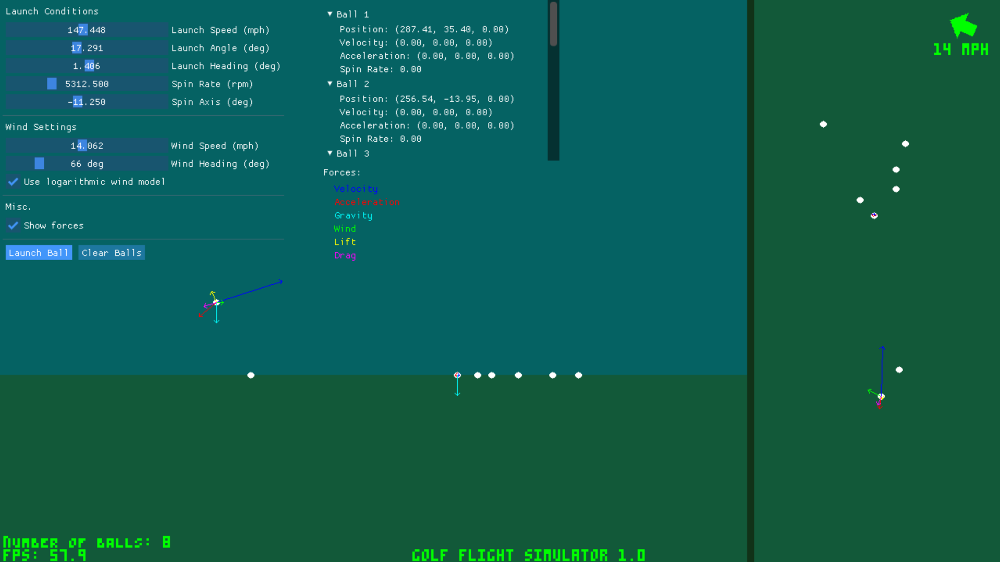

# Golf Flight Simulator 1.0

A simple program to calculate the trajectory of a golf ball.

Libraries used: 
SDL2 
SDL_ttf 
SDL_gfx 
imgui 
tracy (profiling)

See the comments in main.cpp for a general list of todos.
